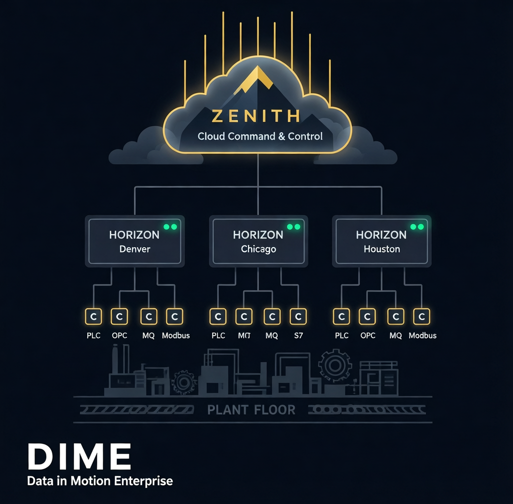

# DIME

### Data in Motion Enterprise

**The industrial data platform that connects every machine, every protocol, every site — from plant floor to cloud — in milliseconds.**

[Website](https://datainmotionenterprise.com)

---

| Component | Description | Downloads | Docker |
|-----------|-------------|-----------|--------|
| **[Zenith](#-dime-zenith--the-cloud)** | Cloud command & control server | [Binary Releases](https://github.com/DataInMotionEnterprise/DIME-Releases/releases/tag/zenith-1.0.1) | [Images](https://hub.docker.com/r/datainmotionenterprise/zenith/tags) · [Instructions](https://github.com/DataInMotionEnterprise/DIME-Zenith.Docker) |
| **[Zenith UX](#-zenith-ux--fleet-command-center)** | Fleet management desktop app | [Binary Releases](https://github.com/DataInMotionEnterprise/DIME-Releases/releases/tag/zenith-configurator-1.0.0) | — |
| **[Horizon](#-dime-horizon--the-gateway)** | Site gateway & field manager | [Binary Releases](https://github.com/DataInMotionEnterprise/DIME-Releases/releases/tag/horizon-1.0.1) | [Images](https://hub.docker.com/r/datainmotionenterprise/horizon/tags) · [Instructions](https://github.com/DataInMotionEnterprise/DIME-Horizon.Docker) |
| **[Connector](#-dime-connector--the-edge)** | Edge data collection endpoint | [Binary Releases](https://github.com/DataInMotionEnterprise/DIME-Releases/releases/tag/connector-3.1.5) | [Images](https://hub.docker.com/r/datainmotionenterprise/connector/tags) · [Instructions](https://github.com/DataInMotionEnterprise/DIME-Connector.Docker) |
| **[Connector UX](#-connector-ux--local-operations-console)** | Local connector management app | [Binary Releases](https://github.com/DataInMotionEnterprise/DIME-Releases/releases/tag/connector-configurator-1.0.0) | — |

📖 **[Connector Field Manual](../docs/DIME-Connector%20Field%20Manual.pdf)** — Complete protocol reference and configuration guide

---

## The Problem

Manufacturing is drowning in data — but starving for insight. Every plant floor is a patchwork of PLCs, robots, CNCs, sensors, and legacy systems, each speaking a different protocol. Getting that data into the systems that need it — analytics platforms, cloud dashboards, digital twins — traditionally requires expensive middleware, months of integration work, and a team of specialists.

**DIME changes that.**

## The Solution

DIME is a complete industrial data platform that bridges the gap between operational technology (OT) on the plant floor and information technology (IT) in the cloud. It's a three-tier architecture designed for the realities of modern manufacturing: distributed sites, diverse equipment, strict network policies, and the need for real-time performance.

**One platform. 50+ protocols. Sub-millisecond latency. Zero custom code.**

---

## Architecture Overview

DIME is built on three layers that work together seamlessly:

| Layer | Component | Role |
|-------|-----------|------|
| **Edge** | **Connector** | Sits on the plant floor. Speaks every industrial protocol. Moves data at wire speed. |
| **Gateway** | **Horizon** | Manages a site. Bridges cloud commands to edge devices. One per facility. |
| **Cloud** | **Zenith** | The command center. Orchestrates the entire fleet from anywhere. |

Each layer is independently deployable, individually scalable, and designed to work across unreliable networks, strict firewalls, and air-gapped environments.

---

## Components

### ⚡ DIME Connector — The Edge

The Connector is where data meets the machine. It's a high-performance service that runs on the plant floor, connecting directly to PLCs, robots, CNCs, sensors, databases, message brokers, and more — translating their native protocols into a unified data stream.

**What makes it different:**

- **50+ industrial protocols** out of the box — Siemens S7, Rockwell EtherNet/IP, OPC-UA, Modbus TCP, MQTT, MTConnect, Fanuc, Yaskawa, Beckhoff ADS, and many more
- **Sub-millisecond latency** powered by a lock-free Disruptor ring buffer architecture — the same pattern used in high-frequency trading systems
- **Million+ messages per second** on commodity hardware
- **Report By Exception** — intelligent change detection reduces bandwidth by up to 90%
- **Zero-code configuration** — define your entire data pipeline in YAML. No programming required.
- **Inline scripting** — when you need transformation logic, embed Lua or Python scripts directly in your config
- **Hot reload** — add, modify, or remove protocol connections without stopping the service
- **Any-to-any routing** — read from any source, write to any sink. MQTT to InfluxDB. OPC-UA to Splunk. S7 to PostgreSQL. Any combination.
- **Built-in REST API** with Swagger UI for monitoring and management

The Connector is the foundation of every DIME deployment. Whether you're connecting a single CNC or an entire factory of 200+ machines, it handles the heavy lifting at the edge.

<strong>Supported deployment targets</strong>

- Windows Service (32-bit and 64-bit)
- Linux daemon
- Docker container
- ARM64 edge devices

---

### 🌐 DIME Horizon — The Gateway

Horizon is the site manager. One Horizon instance manages all Connectors at a physical location — a factory, a warehouse, a remote facility. It acts as the bridge between cloud management and edge devices, eliminating the need for direct cloud-to-edge connectivity.

**What makes it different:**

- **Pull-based architecture** — Horizon reaches out to the cloud on a schedule, not the other way around. This means zero inbound firewall rules, full NAT traversal, and compatibility with the strictest network policies.
- **Task-driven orchestration** — the cloud says *what* needs to happen; Horizon figures out *how* to make it happen locally
- **Fleet health monitoring** — continuously tracks the health, version, and connectivity of every Connector it manages
- **Remote configuration** — push YAML configuration changes to any Connector from the cloud, with validation before deployment
- **Graceful degradation** — if the cloud goes offline, edge devices keep running. When connectivity returns, everything syncs automatically.
- **Zero-downtime updates** — reload configuration on the fly without restarting the gateway

Horizon is what makes DIME work at scale. A single Zenith instance can manage hundreds of Horizon gateways across the globe, each managing dozens of Connectors — all without opening a single inbound port.

---

### ☁️ DIME Zenith — The Cloud

Zenith is the brain of the operation. It's a cloud-hosted API server backed by MongoDB that provides centralized command and control over every Horizon and Connector in your fleet.

**What makes it different:**

- **Centralized fleet management** — see every site, every gateway, every connector from one place
- **Automated health monitoring** — detects stale check-ins and automatically generates diagnostic tasks
- **Task-based orchestration** — issue commands that flow from cloud to gateway to edge and back, with full status tracking
- **Configuration as code** — every device's YAML configuration is stored, versioned, and distributable from the cloud
- **Real-time data aggregation** — collects status, performance metrics, and live data from every connector across every site
- **Scalable by design** — MongoDB backend handles fleets of any size, with compound indexes optimized for multi-site queries

**Task types** include retrieving and pushing configurations, collecting live status and data, restarting services, and managing individual adapter lifecycles — all remotely, all without SSH or VPN access to the edge.

---

### 🖥️ Zenith UX — Fleet Command Center

Zenith UX is the desktop application that puts the entire DIME fleet at your fingertips. Built with Tauri and React, it's a modern, lightweight management console that connects directly to your Zenith database.

**Highlights:**

- **Fleet tree view** — hierarchical navigation of all Horizons and their Connectors, with real-time health indicators
- **Live dashboard** — fleet-wide metrics at a glance: device counts, health status, recent task activity
- **Deep-dive detail views** — drill into any Horizon or Connector to see properties, live status, current data, and full YAML configuration
- **Integrated YAML editor** — view and edit configurations with syntax highlighting, then push changes with a single click
- **Task management** — issue tasks, track execution, and view results without touching a command line
- **Adapter-level control** — start, stop, add, edit, or delete individual protocol adapters on remote Connectors
- **Configurable polling** — tune refresh rates for fleet, detail, and task views independently
- **Dark industrial theme** — purpose-built for control room environments

---

### 🔧 Connector UX — Local Operations Console

Connector UX is the companion desktop application for operators and technicians working directly with Connectors on the plant floor. While Zenith UX manages the fleet from the cloud, Connector UX gives you hands-on control of local instances.

**Highlights:**

- **Multi-instance management** — connect to and switch between multiple Connector instances running on the local network
- **Real-time monitoring dashboard** — live stats on sources, sinks, message throughput, and health status with configurable refresh intervals
- **WebSocket live feed** — stream events and data in real time: connections, disconnections, faults, and message flow
- **Full configuration editor** — Monaco-powered YAML editor with validation, download/upload, and one-click deployment
- **Schema browser** — explore every connector type's configuration schema with property definitions, required fields, and examples
- **Adapter lifecycle control** — start, stop, add, edit, and delete individual connectors with instant feedback
- **Data stream viewer** — real-time message inspection from WebSocket sink connectors

---

## 📡 Protocol Support

DIME Connector speaks the language of your equipment — no matter how old, how new, or how specialized.

| Category | Protocols |
|----------|-----------|
| **Industrial PLCs** | Siemens S7 (300/400/1200/1500), Rockwell EtherNet/IP (MicroLogix, CompactLogix, ControlLogix), Beckhoff TwinCAT ADS, Modbus TCP |
| **Robotics** | Fanuc, Yaskawa |
| **Manufacturing Standards** | OPC-UA, OPC-DA, MTConnect (Agent + SHDR), Haas SHDR |
| **Messaging** | MQTT, Sparkplug B, Apache ActiveMQ, Redis Pub/Sub |
| **Databases** | SQL Server, PostgreSQL, MongoDB, InfluxDB |
| **Web & API** | HTTP Client/Server, WebSocket Server, REST/JSON, XML Scraping |
| **Analytics** | Splunk HEC, Splunk Edge Hub |
| **Specialized** | ROS2 (Robot Operating System), TCP ASCII, UDP Server, CSV Writer |

**And more.** The Connector architecture is extensible — new protocols can be added without modifying the core engine.

---

## 🔄 How It Works

1. **Connectors** run on the plant floor, continuously reading data from industrial equipment using native protocols and routing it to configured destinations.

2. **Horizons** manage the Connectors at each site. They periodically check in with the cloud, report fleet health, pick up pending tasks, execute them locally, and report results back.

3. **Zenith** sits in the cloud, maintaining the state of the entire fleet. It auto-detects stale devices, generates diagnostic tasks, stores configurations, and aggregates data from every site.

4. **Zenith UX** and **Connector UX** provide the human interface — whether you're managing a global fleet from headquarters or troubleshooting a single connector on the factory floor.

**The result:** a unified data fabric that spans from the machine to the cloud, with complete visibility, remote management, and real-time performance — all without exposing your OT network to the internet.

---

## 🏭 Built for Industry

DIME was designed from the ground up for the unique challenges of industrial environments:

- **Network isolation** — works across firewalls, NAT, and air gaps with outbound-only communication
- **Legacy equipment** — connects to decades-old PLCs alongside modern IoT sensors
- **Real-time performance** — sub-millisecond latency for time-critical data like vibration analysis, motion control, and quality inspection
- **Resilience** — edge devices continue operating independently if cloud connectivity is lost
- **Configuration as code** — YAML-based configs are version-controllable, auditable, and reproducible
- **Minimal footprint** — the Connector runs as a single binary with no external dependencies

---

## Getting Started

Each component can be deployed independently based on your needs:

| I want to... | Start with |
|--------------|------------|
| Connect machines and move data locally | **Connector** |
| Manage connectors from a local desktop | **Connector UX** |
| Manage multiple sites from the cloud | **Connector** + **Horizon** + **Zenith** |
| Manage the fleet from a desktop app | **Zenith UX** |

---

**DIME — Data in Motion Enterprise**

*From the plant floor to the cloud. Every machine. Every protocol. In real time.*

